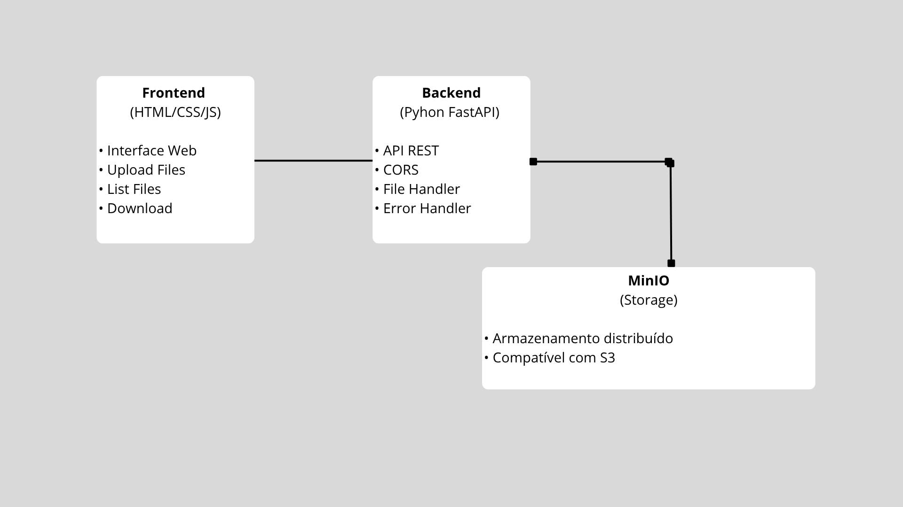

# Projeto: Mini Dropbox 

Projeto desenvolvido para avaliação da disciplina de Sistemas Distribuídos.

Aplicação de armazenamento de arquivos distribuído que permite upload, listagem e download de arquivos através de uma interface web simples. A solução utiliza MinIO como backend de armazenamento distribuído, FastAPI para a API REST e uma interface web simples.

## Arquitetura da Solução



### Componentes:

1. **Frontend**: Interface web para interação do usuário
2. **Backend (FastAPI)**: API REST que gerencia operações de arquivo
3. **MinIO**: Sistema de armazenamento distribuído compatível com S3

## Executando a aplicação

### Pré-requisitos

- Python 3.8+
- Docker

### Passo a passo

1. **Subir container docker**:
   ```bash
   cd mini-dropbox
   docker-compose up -d
   ```

2. **Instalar dependências**:
   ```bash
   cd backend
   pip install -r requirements.txt
   ```

3. **Executar o backend**:
   ```bash
   uvicorn main:app --reload 
   ```

4. **Criar Bucket no MinIO Console**
    - Acessar MinIO Console: `http://localhost:9001` (usuário: admin / senha: admin123)
    - Opção "Create Bucket"
    - Nomear com "Arquivos"

5. **Acessar a aplicação**:
   - Abrir o arquivo `frontend/index.html` no navegador

## Testando a aplicação

1. **Upload de Arquivos**:
   - Clique em "Escolher arquivo"
   - Selecione o arquivo desejado
   - Clique em "Enviar"

2. **Listar Arquivos**:
   - Os arquivos são listados automaticamente
   - A lista é atualizada após cada upload

3. **Download de Arquivos**:
   - Clique no botão de download (⬇️) ao lado do arquivo
   - O download iniciará automaticamente


## Justificativa Técnica: Escalabilidade e Tolerância a Falhas

### Escalabilidade

#### 1. **Armazenamento Distribuído (MinIO)**
- **Escalabilidade Horizontal**: MinIO suporta adição de novos nós sem interrupção
- **Sharding Automático**: Distribuição automática de dados entre múltiplos servidores
- **S3 Compatibility**: Permite migração para AWS S3 ou outros provedores compatíveis
- **Performance**: Throughput linear com adição de nós

#### 2. **API Stateless (FastAPI)**
- **Múltiplas Instâncias**: Backend pode ser replicado horizontalmente
- **Load Balancing**: Suporte nativo para balanceadores de carga
- **Async Support**: Processamento assíncrono para alta concorrência
- **Resource Efficiency**: Baixo consumo de memória por requisição

#### 3. **Frontend Distribuível**
- **CDN Ready**: Arquivos estáticos podem ser servidos via CDN
- **Cache Friendly**: Interface otimizada para cache do navegador
- **Responsive**: Adapta-se a diferentes dispositivos e cargas

### Tolerância a Falhas

#### 1. **Redundância de Dados**

- **Erasure Coding**: Proteção contra falhas de até N/2 discos
- **Replicação**: Múltiplas cópias dos dados em diferentes nós
- **Checksums**: Verificação de integridade automática

#### 2. **Recuperação Automática**
- **Self-Healing**: MinIO detecta e corrige corrupções automaticamente
- **Hot-Swapping**: Substituição de discos sem interrupção do serviço
- **Automatic Failover**: Redirecionamento automático para nós saudáveis

#### 3. **Monitoramento e Observabilidade**
- **Health Checks**: Endpoints de saúde para monitoramento
- **Logs Estruturados**: Facilita debugging e análise
- **Metrics**: Integração com Prometheus/Grafana
- **Alerting**: Notificações proativas de problemas

